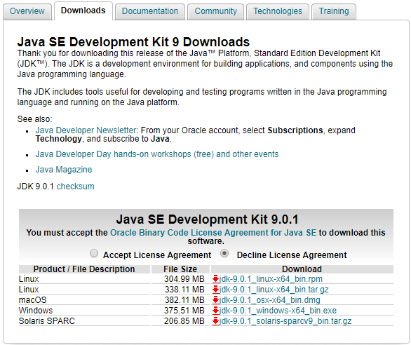
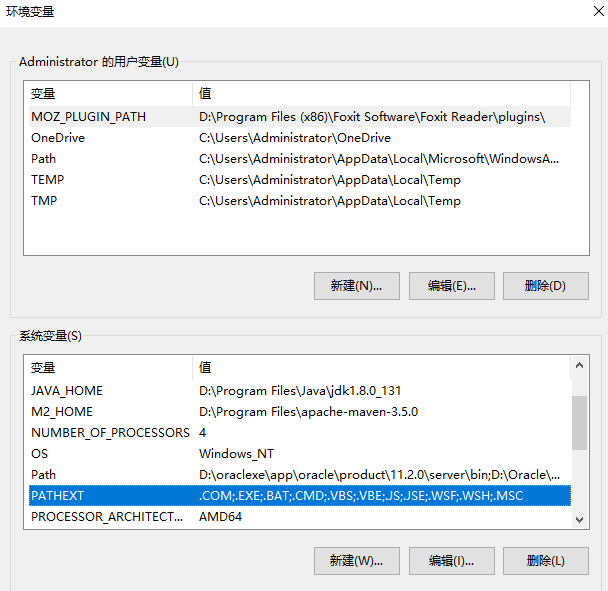
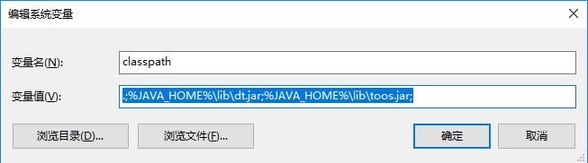
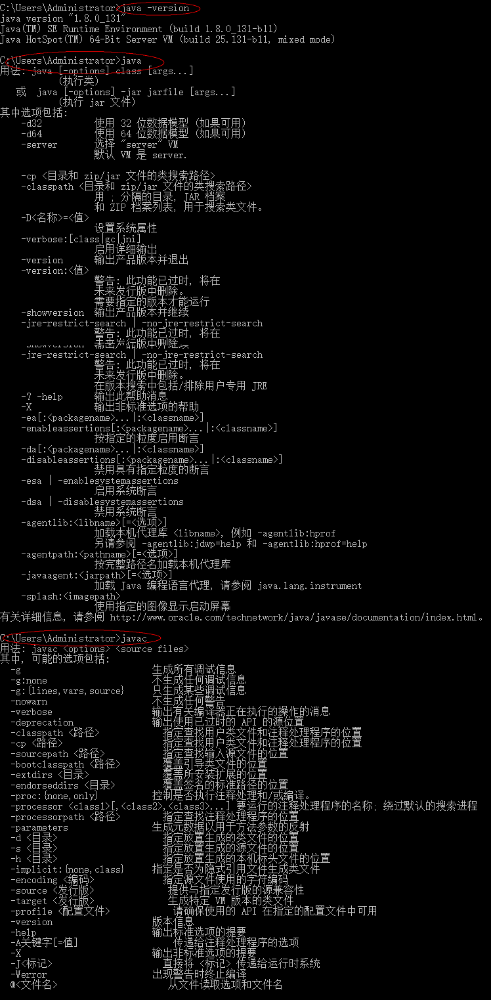

## 2、Java开发环境搭建

[上篇——Chapter1：1、Java语言概述](1、Java语言概述.md)

#### 下载安装JDK

1. [Oracle官网下载JDK链接][http://www.oracle.com/technetwork/java/javase/downloads/jdk9-downloads-3848520.html]



2. 下载完成后运行安装JDK，个人喜欢安装在D盘下；

3. JDK安装目录结构：

   

   - bin：存放工具命令，如javac，java等命令；
   - db：安装JavaDB路径；
   - include：平台特定的头文件；
   - jre：运行Java程序所必须的JRE环境；
   - lib：相关的Jar依赖包；

4. 配置环境变量（Win10为例）：

   1. 依次打开：控制面板——系统和安全——系统——高级系统设置——环境变量——系统变量；

   2. 新建，变量名：JAVA_HOME，变量值：D:\Program Files\Java\jdk1.8.0_131

   3. 找到Path，添加：%JAVA_HOME%\bin（注意分号）

      

   4. 新建，变量名：classpath，变量值：.;%JAVA_HOME%\lib\dt.jar;%JAVA_HOME%\lib\toos.jar;（前面加.表示当前路径，用以强制Java解释器在当前路径下搜索Java类，用；分隔变量）  如图：

      

      - 注意，配置了classpath，java命令才能被识别到，这个地方很容易出错，请一定注意。

5. 验证安装：

   快捷键Win+R打开运行——CMD，输入Java运行命令，javac编译命令或Java -version，如下图显示就是安装成功，So easy！！！

   ​	

   搭建好了环境，我们来跑一个小小的程序，也就是每一个程序员都知道的：HelloWorld

   #### 附1：Linux环境安装JDK：

   1. 下载对应版本的JDK，通常是tar.gz后缀文件；

   2. 通过xftp客户端上传至Linux环境/usr目录下；

   3.  ```shell
      cd /usr 
      mkdir java
      cp jdk-8u161-linux-i586.tar.gz java/
      cd java 
      tar -xzvf jdk-8u161-linux-i586.tar.gz 
      ```

   4. 配置环境变量：

      ```shell
      vim /etc/bashrc
      #文件末尾添加
      export JAVA_HOME=/usr/java/jdk1.8.0_161
      export JRE_HOME=${JAVA_HOME}/jre
      export CLASSPATH=.:${JAVA_HOME}/lib:${JRE_HOME}/lib:$CLASSPATH
      export JAVA_PATH=${JAVA_HOME}/bin:${JRE_HOME}/bin
      export PATH=${JAVA_PATH}:$PATH
      ```

   5. 执行命令使配置生效：```source /etc/bashrc```

   6. 输入```java -version```命令查看java版本发现报错：

      ```shell
      -bash: /usr/java/jdk1.8.0_161/bin/java: /lib/ld-linux.so.2: bad ELF interpreter: No such file or directory
      ```

      出现该问题是因为JDK和系统版本不匹配的问题。

   7. 执行命令：```yum install glibc.i686```解决版本问题，输入```java -version```发现已正确安装：

      ```shell
      java version "1.8.0_161"
      Java(TM) SE Runtime Environment (build 1.8.0_161-b12)
      Java HotSpot(TM) Client VM (build 25.161-b12, mixed mode)
      ```

      ​

   [下篇——Chapter1：3、第一个Java程序](3、第一个Java程序.md)

   ​

