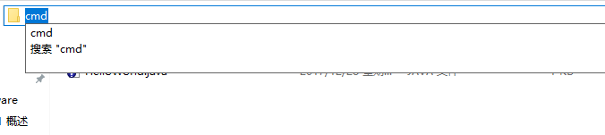
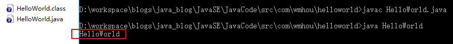
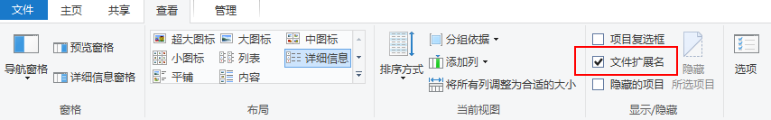
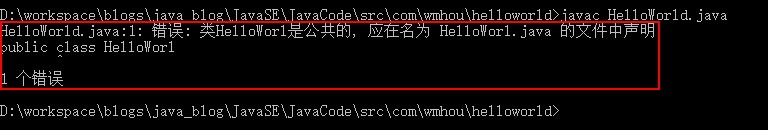

## 3、第一个Java程序##

[上篇——Chapter1：2、Java开发环境搭建](2、Java开发环境搭建.md)

#### 编辑Java源代码

在任意文件夹下新建一个文本文件，并在文件中输入以下代码：

```java
public class HelloWorld
{
	public static void main(String[] args)
	{
		System.out.println("HelloWorld");
	}
}
```

将上面文本文件保存为HelloWorld.java（扩展名从.txt变为.java），此文件就是Java程序源文件。

#### 编译Java程序

在HelloWorld.java文件所在文件夹下打开CMD，我所知道的有这样几种方法：

1. Win+R快捷键：输入：CMD打开，输入：D:切换到D盘，输入：cd /代码路径/找到指定文件夹，用过Linux都知道Windows的命令行用起来多纠结；

2. 直接找到源码位置，在地址栏输入：cmd然后Enter打开，如图；

   

3. 找到源码位置，按住shift右击鼠标，找到cmd打开；

在cmd窗口输入：javac HelloWorld.java编译源码，生成一个HelloWorld.class字节码文件，如图：


#### 运行Java程序

继续在cmd输入：java HelloWorld，界面输出：HelloWorld则运行成功，如图：



如果出现无法加载主类的提示，建议参看[Java开发环境搭建](2、Java开发环境搭建)检查环境变量是否正确配置。

#### Java源文件命名规则

我们的文件自然不是随意命名的，简单规则如下：

- Java源文件后缀一定是.java（建议设置显示文件扩展名），如图：

  

- 一般来说，Java源文件名是任意的，不过，如果源码定义了public类，那么主文件名必须与public类相同，不信？我们把代码里面public修饰的HelloWorld去掉一个d，javac编译走一个；

  

- 一般我们使用首字母大写的驼峰式命名法，关于命名规范，后面还会详细说道。

- Java严格区分大小写

#### 注意的问题

环境变量一定一定要仔细设置，就这一个小小的HelloWorld，动手操作时真的不一定一帆风顺哦！！！

[本节代码路径](https://github.com/wmhou/java_blog/tree/master/JavaSE/JavaCode/src/com/wmhou/chapter1)

[下篇——Chapter2：1、变量](https://github.com/wmhou/java_blog/blob/master/JavaSE/Chapter2%20%E5%8F%98%E9%87%8F%E5%92%8C%E6%95%B0%E6%8D%AE%E7%B1%BB%E5%9E%8B/1%E3%80%81%E5%8F%98%E9%87%8F.md)


