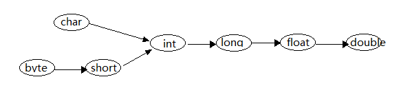

### 5、基本数据类型

[上篇——Chapter2：1、变量](1、变量.md)

####一、分类

Java的基本数据类型可以划分为四类八种，如下：


- **整形：**

  用于存放整数，赋值超出范围会产生编译错误，例如：

  ```java
  public class DataTest {
      public static void main(String[] args)
      {
          byte b = 100;
          short s = 200;
          int i = 300;
          long l = 400;
          System.out.println("b = " + b + "\n" +"s = " + s + "\n" + "i = " + i + "\n" + "l = " + l); 
        	//超出范围，产生编译错误
          //byte b1 = 300;   
      }
  }
  ```

  上面代码输出结果为：

  如果给byte型赋值300，则会产生编译错误，说明每一个数据类型的取值都是有范围的。

- **字符类型：**

  char型用于存入一个字符，用单引号表示，超过一个字符就会产生编译错误，例如：

  ```java
  public class DataTest {
      public static void main(String[] args)
      {        
  		//字符型
          char c1 = 'A';
          char c2 = 'AB'; //编译错误
          char c3 = '字';
          char c4 = '字符';//编译错误
      }
  }
  ```

- **浮点型：**

  Java浮点数有两种，double代表双精度64位，float代表单精度32位，Java语言的浮点类型默认double类型，如果希望把一个浮点数当成float类型处理，要加F或f，例如：

  ```java
  float f = 3.14F;
  double d = 3.14;
  ```

- **布尔型：**

  布尔型只有一种boolean类型，用于表示逻辑上的"真"或"假"，对应true / false，例如：

  ```java
  boolean b1 = false;
  boolean b2 = true;
  ```

  boolean主要用于做为旗标进行流程控制，一般使用场景有：

  - if条件语句；
  - while循环控制语句；
  - do while循环控制语句；
  - for循环控制语句
  - 三目运算符等

#### 二、基本类型之类型转换：

- **1、基本类型转换**

  Java8种基本类型之间，除去boolean之外的7种，大部分相互之间可以转换，又分为两种转换方式：自动类型转换和强制类型转换。

  - 自动类型转换：

    如本节图一所示，当把一个取值范围小的数值或变量直接赋值给另一个取值范围大的变量时，就会发生强制类型转换；反之则需要强制类型转换，例如：

    ```java
    public class DataChangeTest {

        public static void main(String[] args) {
            byte b = 100;
            int i = b;
            System.out.println("b = " + b);

            long l = 1000L;
            float f1 = l;
            System.out.println("f1 = " + f1);

            float f = 3.14F;
            double d = f;
            System.out.println("d = " + d);

            char c = 'A';
            int i1 = c;
            System.out.println("i1 = " + i1);

            byte b1 = 65;
            //byte类型不能自动转换为char类型
            //char c1 = b1;
          
          	char c1 = 'B';
            //以下代码将编译报错，char型不能自动转换为byte型
            //byte b2 = c1;
            //short s = c1;
        }
    }
    ```

    自动类型转换图：

    

- **2、强制类型转换**

  如果我们需要反向转换，也就是将上图箭头右边的类型转换为左边的类型，就需要强制类型转换了，转换的语法是：（转换类型）值，例如：

  ```java
          int i2 = 130;
          byte b2 = (byte)i2;
          System.out.println(b2);
  ```

  上面这个实例输出的结果是：-126；想象一下有一大一小两个瓶子，如果大瓶子水不多将其倒入小瓶子的话还好，如果水很多，就会发生溢出现象，从而造成数据损失，上例就是典型的溢出。

- **3、表达式类型的自动提升**

  当一个表达式中包含多种基本数据类型的时候，表达式中的数据类型将会自动提升到与表达式中最高等级操作数相同的类型，例如：

  ```java
          short s = 10;
          int i3 = 100;
          i3 = i3 + s;
          System.out.println("i3 = " + i3);
  ```

  输出结果为：110，表达式中自动将short提升为int型，进行了加法运算；

  注意：+ 的存在如果是在基本数据类型的话就是加法运算符，如果是有字符串和基本数据类型存在，则可能作为字符串连接符，例如：

  ```java
  		System.out.println("hello" + 'A' + 3);
          System.out.println(7 + 'A' + "hello");
  ```

  上面例子分别输出：helloA3和72hello，为什么会这样呢？

  第一个表达式先进行字符串连接将A转换为字符串拼接，接着对helloA+3运算，将3转换为字符串，得到：helloA3；

  第二个表达式先进行7+A运算，将A提升为int型，转换成A对应的ASCII值：65，相加得到72，与字符串hello运算将72提升为字符串，然后进行连接，得到结果：72hello；

[本节代码路径](https://github.com/wmhou/java_blog/tree/master/JavaSE/JavaCode/src/com/wmhou/chapter2)

[下篇——Chapter2：3、运算符](3、运算符.md)


