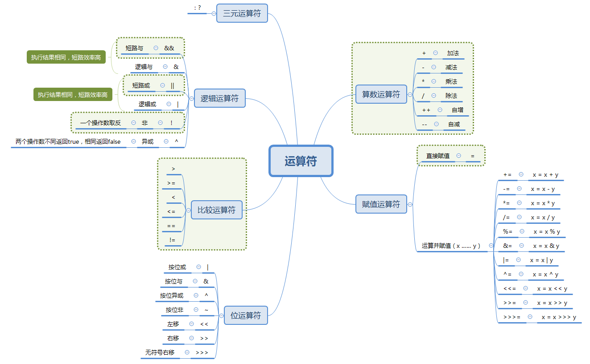
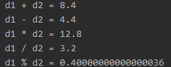

### 3、运算符

[上篇——Chapter2：2、基本数据类型](2、基本数据类型.md)

Java语言中运算符分为以下几种：



一般来说项目上主要使用直接赋值、算数、逻辑和比较运算符这几类，运算并赋值在笔者所在团队是不可使用的，因为可读性相对差，位运算的话在笔者经历的项目中也是比较少用的，知道大概的意思就可以，细节可以在用到的时候再查询。

####算数运算符：+、-、*、/、%、++、--

```java
public static void main(String[] args) {
        double d1 = 6.4;
        int d2 = 2;
        int d3 = 0;

        System.out.println("d1 + d2 = " + (d1 + d2));
        System.out.println("d1 - d2 = " + (d1 - d2));
        System.out.println("d1 * d2 = " + (d1 * d2));
        System.out.println("d1 / d2 = " + (d1 / d2));

        System.out.println("d1 / d3 = " + (d1 / d3)); //结果输出：d1 / d3 = Infinity
        // System.out.println("d2 / d3 = " + (d2 / d3)); //结果异常

        System.out.println("d1 % d2 = " + (d1 % d2));
        // System.out.println("d2 % d3 = " + (d2 % d3)); //结果异常
    }
```

输出的结果是：



上面实例中实现了自动类型转换后的算数运算，值得注意的是除法运算和取余运算：

- 在除法运算，如果两个操作数都是整数，输出结果也是整数且除数不能为0，否则输出异常，如果有一个浮点数或者两个浮点数，除数为0时输出结果为：无穷大。
- 取余运算中，取到的余数不一定是整数，取余也是要用到除法运算，所以遵循除法运算的规则，不过在有一个浮点数或者两个浮点数的运算中，如果第二个操作数是0，那么输出结果是非数：NaN。

++、--和前置后置：

```java
public static void main(String[] args) {        
	int i = 5;
    System.out.println(i++);
    System.out.println(i);

    int j = 6;
    System.out.println(++j);
    System.out.println(j);
  
    int a = 4;
    System.out.println(a++ + 3 + a-- + ++a - 1); //4 + 3 + 5 + 5 - 1
}
```

以上实例输出结果分别为：5、6、7、7、16；

- 后置：当++或者--后置时，先对操作数取值，再进行运算；
- 前置：当++或者--前置时，先进行运算，再取运算后的操作数的值；
- --自减：用法和++基本一致，不过是操作数减1；
- 上面实例最后一个输出解析：a++ +3，先进性运算得到7，此时a=5，7+5得到12，此时a = 4，然后12 + ++a计算时，先运算++a，此时a=5，12+5=17，再减1得到结果16；

#### 赋值运算：=

赋值运算符用于为变量赋值，除了前面的例子中看到的直接赋值，还可以将变量或者表达式赋值给另一个变量，参看本节图1，此处不再叙述。

#### 逻辑运算符和比较运算符：

- &&和&：与的运算，前者短路，后者不短路，也就是说，使用前后两个表达式运算时同时为true则返回true，有一个false则返回false，但是&&判断如果第一个表达式返回false，则不进行后面表达式运算，直接返回false，&要判断所有的表达式，使用&&效率更高；

- ||和|：或的运算，前后表达式只要有一个true，则整体返回true，否则返回false，同样的，||运算只要判断有一个表达式返回true则结束运算直接返回true，|要对所有表达式运算才会返回，||效率更高；

- ！：非，操作数取反；

- ^：异或，两个操作数不同则返回true，否则返回false；

- 实例如下：

  ```java
  public static void main(String[] args) {         
  	System.out.println(6 > 4 && 3 > 5); //false
      System.out.println(6 > 4 & 3 >= 5); //false
      System.out.println(6 > 4 || 3 > 5); //true
      System.out.println(6 > 4 | 3 > 5); //true
      System.out.println(!(6 > 4)); //false
      System.out.println(6 > 4 ^ 5 > 3);  //false
  	System.out.println(4 == 5);  //false
  }
  ```

#### 三元运算符：

三元运算符也叫三目运算符，用法很简单，实例如下：

```java
System.out.println(5 >=3 ? "你是对的":"你又错了");
```

结果输出：你是对的，解析一下，先对前面的逻辑表达式运算得到true的结果，则返回第一个操作数的值，如果表达式是false，则返回第二个操作数的值

#### 位运算符：

位操作都是基于二进制来说的，我们平时使用都是十进制，二进制的基本法则是逢二进一，我们有一个方法可以把十进制整数转换为二进制字符串，也可以用Integer.parseInt()方法实现二进制到十进制的转换，如下：

```java
//输出：10的二进制表达式是：1010
System.out.println("10的二进制表达式是：" + Integer.toBinaryString(10));
//输出：1010的十进制表达式是：1010
System.out.println("1010的十进制表达式是：" + Integer.parseInt("1010", 2)); 
```

输出结果是1010和10，基于以上方法我们看一下位运算：

- 按位或|：对每一位进行或运算：

  ```java
  int m = 6;
  int n = 7;
  System.out.println(m + "的二进制表达式是：" + Integer.toBinaryString(m)); //输出110
  System.out.println(n + "的二进制表达式是：" + Integer.toBinaryString(n)); //输出111
  System.out.println(m | n); //输出结果为7，或运算后得到二进制111，转换十进制得到7
  ```

- 按位与&：对每一位进行与运算：

  ```java
  System.out.println(m | n); //输出结果为6，与运算后得到二进制110，转换十进制得到6
  ```

- 异或^：

  任何数和自己异或都是0；

  任何数和0异或都等于自己；

  ```java
  System.out.println(m ^ n); //输出结果为1，或运算后得到二进制001，转换十进制得到1
  System.out.println("和自己异或：" + (m ^ m)); //输出0
  System.out.println("和0异或：" + (m ^ 0));  //输出本身
  ```

- 按位非~：

  m=6，6的二进制是：00000110，取非得到：11111001，换算成二进制得到：-7，这一部分运算涉及到二进制原码，反码和补码，可以再深入了解。

  ```java
  System.out.println(~m); //输出-7
  ```

- 左移和右移<<、>>：

  左移：根据一个数的二进制，将每一位向左移动，最右一位补0；

  右移：根据一个数的二进制，将每一位向右移动。

  ```java
  //6的二进制是110
  System.out.println(Integer.toBinaryString(m));
  //6向左移1位后，变成1100，对应的十进制是12
  System.out.println(m<<1);
  //6向右移1位后，变成11，对应的十进制是3
  System.out.println(m>>1);
  ```


[本节代码路径](https://github.com/wmhou/java_blog/tree/master/JavaSE/JavaCode/src/com/wmhou/chapter2)


