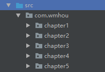

## 3、封装

[上篇——Chapter5：02、方法](02、方法.md)

#### 基本概念：

封装是面向对象语言的三大特征之一，另外还有继承和多态，封装是指：将对象的状态信息隐藏在对象内部，不允许外部程序直接访问对象内部信息，而是通过该类所提供的方法操作和访问类内部信息。为什么要使用封装呢？因为我们经常会使用对象访问某个成员变量，如果第一次访问时给了值，第二次访问时又可能去改变属性的值，这样在语法上是不会有问题的，但是有悖于现实，所以使用封装，隐藏细节，而提供了方法访问。

具体实现封装就要用到访问控制符来实现。

#### 访问控制符：

Java中提供了四种访问控制权限，分别用private、default、protected和public表示，这四个访问控制符权限由小到大：

- private：修饰属性、构造方法和方法，权限是当前类；
- default：修饰属性、构造方法和方法，权限是同包内，可以不加任何访问控制符默认default修饰；
- protected：修饰属性、构造方法和方法，权限是子类，如果使用protected修饰，通常是希望子类重写该方法；
- public：修饰类、属性、构造方法和方法，最高权限，不论是否在同一个包内。

下面实例我们创建两个类，AccessControl类中定义了两个private的属性，定义了public的getter和setter方法，在AccessControlTest类中创建对象，访问某个属性，我们发现private的属性，在不同类中是没法直接访问的，只能访问public的方法，这样就隐藏了类的细节，实现了封装。由此看来，Java类中实例变量的getter和setter方法就有了很重要的意义，在当前类之外，只能通过getter和setter方法操作属性。

```java
public class AccessControl {

    private int id;
    private String name;

    public int getId() {
        return id;
    }

    public void setId(int id) {
        this.id = id;
    }

    public String getName() {
        return name;
    }

    public void setName(String name) {
        this.name = name;
    }

}
```

```java
public class AccessControlTest {
    public static void main(String[] args)
    {
        AccessControl control = new AccessControl();
        control.setName("name测试");
        String name = control.getName();
        System.out.println("name：" + name);
    }
}
```

输出结果：

```java
name：name测试
```

说到这里，还要说一下Java中程序涉及的原则：高内聚、低耦合。

- 高内聚：尽可能把模块内部数据、实现细节等隐藏，不允许外部程序直接干预；
- 低耦合：暴露少量的方法给外部使用。

关于访问控制符，有这样一些原则：

- 类中大部分成员变量都应该是private修饰，除非是一些static修饰的变量才有可能用public修饰，类内部使用的方法也使用private修饰；
- 如果某个类主要作为父类，希望子类重写方法而不是给外部使用，应该用protected修饰；
- 给外部其他类使用的方法由public修饰，所以一般用public修饰构造方法，除非是单例模式，设计模式后面会说。

#### package和import：

前面多次说到包这个概念，那么什么是包呢？

先看一下我们这个项目结构              

src源码目录下，创建了com.wmhou包，在这个包下面又创建了多个chapter来存放不同章节的代码示例，我们把具有类似功能的多个类放在一个包下，包的概念在windows目录结构中其实就是一层层文件夹。实际开发中我们包名定义一般遵循Oracle公司的写法，域名+公司+项目（+子模块）的形式，一般来说我们会在一个类的首行写明这个类所属的包，如下：

```java
package com.wmhou.chapter5.accesscontrol;

public class AccessControl 
{
}
```

那么当前类的类名其实就是：com.huawei.chapter4.AccessControl，如果我们需要在其他的包内引用这个类，就要使用import关键字引包，假如说我们要使用chapter4这个包下的ArrayTest这个类，写法如下：

```java
import com.wmhou.chapter4.ArrayTest;
```

import写在一个类的package和class之间，如果有javadoc注释的话，写在注释后面，类名之前，当然，如果不用import的话就要写上类的全名，当然，一般不这么写，这么写的情况是，不同两个包内有两个相同的类名，而且参数相同，要使用这两个类的时候，某一个类就要加上全名才能区分。

```java
com.wmhou.chapter4.ArrayTest test = new com.wmhou.chapter4.ArrayTest();
```

#### Java中常用的包：

Java按照不同功能提供了很多种开发人员常用的包，许多常用类就在这些包下，这些类也就是前面说过的API（应用程序接口），列举一些上用的包：

- java.lang：核心类，包含了String、System等常用类，这个包不需要import引入，可以直接使用；
- java.util：这个包包含一些常用工具类，例如Arrays等；
- java.net：提供网络编程相关接口和类，如Socket等；
- java.io：提供输入输出相关操作的接口和类，如ImputStream等；
- java.sql：提供JDBC数据库编程相关的接口和类。

[本节代码路径](https://github.com/wmhou/java_blog/tree/master/JavaSE/JavaCode/src/com/wmhou/chapter5/accesscontrol)

[下篇——Chapter5：04、继承](04、继承.md) 