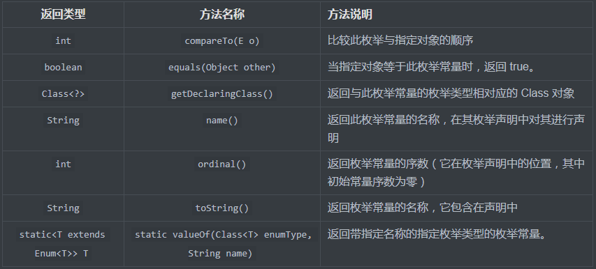

## 9、枚举

[上篇——Chapter5：08、Lambda表达式](08、Lambda表达式.md)

#### 枚举示例

枚举是在Java5中引入的新特性，主要用来表示一些固定且有限的类，比如季节、星期和一些特殊的状态等。假设有这样一个场景，我们实现一个购物车的功能，里面有一项内容是商品状态，想想我们网上购物的场景，商品的状态可以简单分为：已付款、未付款、已发货、未发货、已签收、未签收这样的状态，我们需要一些固定的状态码来定义这些状态，按照原来的写法，我们可以定义一个ProductStatus类或者接口，来表示状态：

```java
public class ProductStatus {
    public static final int FINISH_PAY = 1;
    public static final int NOT_PAY = 2;
    public static final int FINISH_CONSIGNMENT = 3;
    public static final int NOT_CONSIGNMENT = 4;
    public static final int FINISI_RECIVE = 5;
    public static final int NOT_RECIVE = 6;
}
```

上面的实例中我们定义的6个int类型的常量，用来对应商品的状态，根据不同的状态我们需要实现不同的功能。很好用是不是，不过试想一下，我们在实现购物车功能的时候是不是需要来回查看商品状态对应的状态码，现在数量比较少还好说，有些项目中会定义一些类似的常量类或者接口，这样，我们每次使用都要去查看具体的常量是不是存在，是不是会引发出一些小问题？那么如果使用枚举呢？看一下：

```java
public enum ProductStatusEnum {
    FINISH_PAY, NOT_PAY, FINISH_CONSIGNMENT,
    NOT_CONSIGNMENT, FINISI_RECIVE, NOT_RECIVE
}
```

枚举使用enum关键字表示，定义的位置类似于class和interface，它也是一种特殊的类型，名称代码规范遵循类名定义规范，通常我们会在枚举名字后加Enum来进行更准确的表达。

上面的枚举，定义了商品的6个状态，多个值之间用逗号分割。而这些值的调用也很简单，直接用枚举名调用就可以，```ProductStatusEnum.FINISH_CONSIGNMENT```，就是这么简单。那么枚举类型的赋值是怎样的呢？

#### 枚举类型赋值

继续从上面的例子来看，如果我们需要特定的索引来表示商品的状态，而且我们同时要做到用中文更清晰地表示状态的话，我们可以这样写：

```java
public enum ProductStatusHasValueEnum {
    FINISH_PAY("已支付", 1), NOT_PAY("未支付", 2), FINISH_CONSIGNMENT("已发货", 3),
    NOT_CONSIGNMENT("未发货", 4), FINISI_RECIVE("已签收", 5), NOT_RECIVE("未签收", 6);

    private String status;
    private int index;

    ProductStatusHasValueEnum(String status, int index) {
        this.status = status;
        this.index = index;
    }

    public static String getStatus(int index) {
        for (ProductStatusHasValueEnum status : ProductStatusHasValueEnum.values()) {
            if (status.getIndex() == index) {
                return status.getStatus();
            }
        }
        return null;
    }

    public String getStatus() {
        return status;
    }

    public void setStatus(String status) {
        this.status = status;
    }

    public int getIndex() {
        return index;
    }

    public void setIndex(int index) {
        this.index = index;
    }

    public static void main(String[] args) {
        int index = 2;
        String status = ProductStatusHasValueEnum.getStatus(index);
        System.out.println("index = " + index + "的商品状态是：" + status);
    }
}

```

在这个实例的main方法中，我们可以根据传入的索引值找到对应的商品状态，以上实例中我们为商品状态赋予了说明和索引值，并且添加了构造器、普通方法和getter/setter方法，是不是和一个类很相似，需要注意的是，当我们为枚举中的参数赋值的时候，需要手动加入构造方法，构造方法中的参数根据枚举参数传入的值来确定，实例中我们为参数赋予一个String和一个int类型的值，此时构造器中也要存在这样的值，试想一下，有构造器我们就可以实例化枚举的对象了，要正确使用这个构造器创建对象，就要实例化其中的参数。

但是枚举类型的构造器默认并没有写出，事实上枚举类的构造器是private的，枚举类型不能被实例化，我们一般也不会采用像上例中的写法，因为我们主要用到的是枚举最前面定义的枚举值。

这样，除了枚举开始的的状态和构造器这一部分，其余是不是和一个普通的java类完全一样了？但是区别还是很大的，我们知道每一个class都默认集成java.lang.Object类，但是枚举类不是的，它默认继承java.lang.Enum类，下面看一下Enum类的常见方法。

#### 枚举的常见方法

下面列举了枚举的常见方法：



继续使用上面的实例，看一下这些方法的使用：

```java
public enum ProductStatusEnum {
    FINISH_PAY, NOT_PAY, FINISH_CONSIGNMENT,
    NOT_CONSIGNMENT, FINISI_RECIVE, NOT_RECIVE
}
class ProductStatusEnumMethods{
    public static void main(String[] args) {

        // 创建枚举类数组
        ProductStatusEnum[] status = new ProductStatusEnum[]{ProductStatusEnum.FINISH_PAY, ProductStatusEnum.NOT_PAY,
                ProductStatusEnum.FINISH_CONSIGNMENT, ProductStatusEnum.NOT_CONSIGNMENT,
                ProductStatusEnum.FINISI_RECIVE, ProductStatusEnum.NOT_RECIVE};

        for (int i = 0; i < status.length; i++){
            System.out.println("status[" + i + "].ordinal(): " + status[i].ordinal());
        }

        System.out.println("----------------------------------");

        //通过compareTo方法比较,实际上其内部是通过ordinal()值比较的
        System.out.println("status[0].compareTo(status[1]): " + status[0].compareTo(status[1]));
        System.out.println("status[0].compareTo(status[2]): " + status[0].equals(status[2]));

        Class<?> clazz = status[0].getDeclaringClass();
        System.out.println("clazz: " + clazz);

        System.out.println("----------------------------------");

        // name()
        System.out.println("status[0].name(): " + status[0].name());
        System.out.println("status[1].name(): " + status[1].name());

        //toString()
        System.out.println("status[2].toString(): " + status[2].toString());
        System.out.println("status[3].toString(): " + status[3].toString());

        System.out.println("----------------------------------");

        ProductStatusEnum statusEnum = Enum.valueOf(ProductStatusEnum.class, status[4].name());
        System.out.println("statusEnum：" + statusEnum);
    }
}
```

实际执行结果是：

```java
status[0].ordinal(): 0
status[1].ordinal(): 1
status[2].ordinal(): 2
status[3].ordinal(): 3
status[4].ordinal(): 4
status[5].ordinal(): 5
----------------------------------
status[0].compareTo(status[1]): -1
status[0].compareTo(status[2]): false
clazz: class com.wmhou.chapter5.enumdemo.ProductStatusEnum
----------------------------------
status[0].name(): FINISH_PAY
status[1].name(): NOT_PAY
status[2].toString(): FINISH_CONSIGNMENT
status[3].toString(): NOT_CONSIGNMENT
----------------------------------
statusEnum：FINISI_RECIVE
```

再说一下，使用枚举要注意几个地方，避免错误使用：

1. enum 类型不支持 public 和 protected 修饰符的构造方法，因此构造函数一定要是 private 或 friendly 的。也正因为如此，所以枚举对象是无法在程序中通过直接调用其构造方法来初始化的。
2. 定义 enum 类型时候，如果是简单类型，那么最后一个枚举值后不用跟任何一个符号；但如果有定制方法，那么最后一个枚举值与后面代码要用分号';'隔开，不能用逗号或空格。
3. 由于 enum 类型的值实际上是通过运行期构造出对象来表示的，所以在 cluster 环境下，每个虚拟机都会构造出一个同义的枚举对象。因而在做比较操作时候就需要注意，如果直接通过使用等号 ( ‘ == ’ ) 操作符，这些看似一样的枚举值一定不相等，因为这不是同一个对象实例。

上述部分列举了关于Enum的基本内容，这些内容基本可以满足日常开发中对枚举的使用，当然枚举的内容不会只有这些，更多的内容等以后用到再继续更新。Enum 类型提出给 JAVA 编程带了了极大的便利，让程序的控制更加的容易，也不容易出现错误。所以在遇到需要控制程序流程时候，可以多想想是否可以利用 enum 来实现。

[本节代码路径](https://github.com/wmhou/java_blog/tree/master/JavaSE/JavaCode/src/com/wmhou/chapter5/enumdemo)

[下篇——Chapter6：1、集合]()

