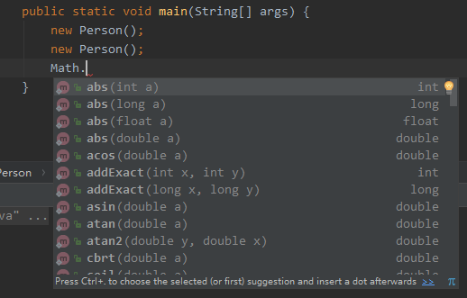
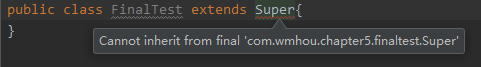

### 6、static和final修饰符

[上篇——Chapter5：5、多态](5、多态.md)

#### static修饰符：

前面章节说到[变量](https://github.com/wmhou/java_blog/blob/master/JavaSE/Chapter2%20%E5%8F%98%E9%87%8F%E5%92%8C%E6%95%B0%E6%8D%AE%E7%B1%BB%E5%9E%8B/1%E3%80%81%E5%8F%98%E9%87%8F.md)的时候，曾说到过一个概念：类变量，我们说用static修饰的变量就是类变量，那么说到static，还有什么作用呢？我们详细看一下，在引入static之前先看一个新概念：

**初始化块**

java中我们使用构造器来对某个对象进行初始化操作，类似于构造器的另一个概念是初始化块，它也可以对Java对象进行初始化操作，看一下下面的实例

```java
public class Person {
    {
        System.out.println("------第一个初始化块------");
    }

    {
        System.out.println("------第二个初始化块------");
    }

    public Person() {
        System.out.println("---无参构造器---");
    }

    public static void main(String[] args) {
        new Person();
    }
}
```

运行代码输出：

```java
------第一个初始化块------
------第二个初始化块------
---无参构造器---
```

上面实例中，我们定义了一个类Person，并顺序创建了两个初始化块和一个无参构造器，初始化块的定义很简单，就是一对{...}，里面写上代码即可，main方法中我们只创建了一个Person对象，从运行结果可以看到，当创建一个对象的时候，JVM会先去执行类中定义的初始化块，如果定义了多个初始化块，则从上往下顺序执行。假如我们要创建多个对象，就会在每次创建对象前先去执行初始化块中的代码，改写一下main方法，我们再创建一个Person对象：

```java
    public static void main(String[] args) {
        new Person();
        new Person();
    }
```

运行程序输出结果：

```java
------第一个初始化块------
------第二个初始化块------
---无参构造器---
------第一个初始化块------
------第二个初始化块------
---无参构造器---
```

说明：初始化块在每次创建对象之前都会先执行，每创建一个对象，顺序执行一次。

初始化块也是类中的成员，但我们也看到，它没有名字也没有标识，自然不能被类或者对象调用，它只会在程序运行时被JVM自动执行。那么疑问来了，既然都可以初始化代码，它和构造器的区别是什么呢？

从上面的实例看一下，初始化块是不能被调用且不能接受任何参数的，因此，不管有多少个重载的构造器，只要创建对象，都会先去执行初始化块，基于这个原因，我们可以把多个构造器中相同的、无须接收参数的代码提取到初始化块中定义，降低冗余。如果我们希望在类初始化的时候执行一些操作，而不是每次创建对象都去重复执行呢？此时就需要用static修饰块，称为静态初始化块。

**静态初始化块**

继续以上面的实例来说，在代码中加入两个static修饰的块，改变之后的代码如下：

```java
package com.wmhou.chapter5.statictest;

/**
 * Description:初始化块演示
 * <br/>网站：<a href="https://github.com/wmhou/java_blog">Java_blog on Github</a>
 * <br/>Program Name: Java_blog
 * <br/>Date:2018-2-27
 *
 * @author 侯伟民
 * @version 1.0
 */
public class Person {
    private int id;
    private String name;
    private String gender;
    private String address;
    {
        System.out.println("------第一个初始化块------");
    }

    {
        System.out.println("------第二个初始化块------");
    }
    static {
        System.out.println("----第一个静态初始化块---");
    }
    static {
        System.out.println("----第二个静态初始化块---");
    }

    public Person() {
        System.out.println("---无参构造器---");
    }

    public static void main(String[] args) {
        new Person();
        new Person();
    }
}
```

运行程序输出结果为：

```java
----第一个静态初始化块---
----第二个静态初始化块---
------第一个初始化块------
------第二个初始化块------
---无参构造器---
------第一个初始化块------
------第二个初始化块------
---无参构造器---
```

从输出结果来看，static块在程序运行时先被执行，有多个static修饰则顺序执行，且优先于初始化块执行。也就是说static块不依赖于对象的初始化而是依赖于类初始化，static块是类相关的，属于类的静态成员，通常用于对类变量执行初始化处理。神奇的static，到底是什么呢？

static，意为静态、全局，static可以用来修饰属性、方法和初始化块，当我们给一个属性或者方法加上static修饰符后，就可以在不创建一个对象的情况下直接用类去引用。

- **静态变量：**tatic修饰的变量称作静态变量。静态变量和一般的成员变量不同，一个类在加载到内存时，静态变量只初始化一次，也就是说所有对象的静态变量在内存中都只有一个存储位置，每个对象中的静态变量都指向内存中同一个地址，它是在所有的对象之间共享的数据。

- **静态方法：**总体来说，static修饰后就是属于类，和任何对象无关，拿一个典型的例子，Java中的Math类来说，这个类作为一个数学工具类存在，定义了很多可以减少我们工作量的方法，如图

  

  这只是小小一部分，试想一下假如这个类下面没有static修饰的方法，我们要使用任何一个方法都要先去new一个对象，如果要在不同方法中大量使用，是不是有点扯了，此时static就显现出作用了，不用创建对象，直接用类名调用，多好。可是偷懒的人们又发现了这样用会出现很多的Math.XXX()方法，是不是可以不用Math，static再次派上用场

- **静态导包：**

  这一种用法，把static方法加在了import之后，如下：

  ```java
  import static java.lang.Math.*;
  ```

  这样，就可以很愉快地去掉Math，直接使用Math类里面的方法了，不过，通常不建议这么玩；

  此外，static方法中不能使用this和super？为什么呢，我们知道this和super代表当前类和父类的对象，但是我们的static可是全局的，虽然属于某个类，但实际上和当前类并没有直接关系，自然不能在这样的方法中直接访问某个类的变量和方法了。

#### final修饰符：

final意为最终的意思。修饰符可以用来修饰类、方法和变量，统一来说，用final修饰的类、方法和变量都是不可改变的，详细看一下：

**final修饰类**

当一个类用final修饰的时候，它是不能够被继承的，例如：

```java
public final class Super{ 
}
```

```java
public class FinalTest extends Super{
}
```

定义一个final修饰的父类Super，用另一个类去extends Super类，会编译错误：



意思是不能继承final修饰的类，final修饰的类中每个方法都应该是final的。

**final修饰方法**

final修饰符修饰方法的时候，该方法不能被重写，基于上面的例子进行修改，在父类Super中加入一个final修饰的方法，在子类中重写会编译错误：

```java
public class Super {
    public final void finalTest(){
        System.out.println("final修饰的方法");
    }
}
```

**final修饰成员变量**

final修饰的成员变量必须显式指定初始值，我们知道成员变量是随着类或对象的初始化而初始化的，所以不能先定义后赋值，看一下实例：

```java
    private final String id;	//这种写法，编译错误
    private final String name = "final";
```

**final修饰局部变量**

- final修饰基本类型变量：此时需要对该final变量赋予初始值，且不能被重新赋值；

  ```java
      public void testFinal(){
          final int i;
          i = 5;
          // i = 8; 在第一次被赋值之后，不能被重新赋值，否则编译错误；
          System.out.println(i);
      }
  ```

- final修饰引用类型变量：此时final只会保证该final变量引用的地址不会改变，也就是说一直引用同一个对象，但是这个对象本身完全可以发生改变。

  ```java
          final int[] arr = {2, 4, 6, 8};
          // arr = new int[]{1, 3, 5, 7};		不能被重新赋值
          arr[0] = 1;
          arr[3] = 7;
          System.out.println(Arrays.toString(arr));
  ```

  输出结果是：

  ```java
  [1, 4, 6, 7]
  ```

  这个实例演示了，final修饰的引用数据类型，不能给赋值，但是可以改变对象内容的。


[本节代码路径_static修饰符](https://github.com/wmhou/java_blog/tree/master/JavaSE/JavaCode/src/com/wmhou/chapter5/statictest)

[本节代码路径_final修饰符](https://github.com/wmhou/java_blog/tree/master/JavaSE/JavaCode/src/com/wmhou/chapter5/finaltest)

[下篇——Chapter5：7、抽象类和接口](7、抽象类、接口和内部类.md) 